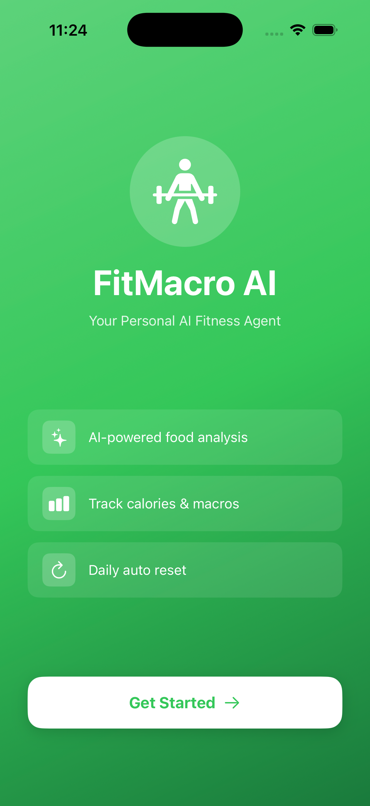

# FitMacroAI 🏋️‍♂️
> AI-powered iOS fitness app — type any food in natural language, get instant macro breakdown

[](https://swift.org)
[](https://developer.apple.com/xcode/swiftui/)
[](https://web-production-f32bc.up.railway.app)

---

## What It Does

User types "rajma chawal 1 katori" → AI returns 420 cal, 19g protein, 60g carbs, 14g fat — automatically.

No manual macro entry. No food database lookup. Just natural language.

---

## Screenshots

| Startup Screen | Goal Setup Screen | Food Log | Add Food |
|----------------| ------------------| ---------| ---------|
|  |  |  | 

---

## Features

- 🤖 AI-powered food analysis — natural language input
- 📊 4 macros tracked — Calories, Protein, Carbs, Fat
- 🎯 Daily calorie goal with live progress bar
- 💾 Data persistence — food log saves across app restarts
- 🔄 Daily auto reset — fresh start every morning
- ✅ One-time onboarding flow

---

## Architecture
```
iOS App (SwiftUI)
      ↓ HTTP POST
FastAPI Backend (Railway)
      ↓ Groq API Call
LLaMA 3.3 70B
      ↓ JSON Response
iOS App displays macros
```

---

## Tech Stack

| Layer | Technology |
|-------|-----------|
| Frontend | SwiftUI (iOS 17+) |
| Networking | URLSession + Async/Await |
| Backend | FastAPI + Python |
| AI Model | LLaMA 3.3 70B via Groq |
| Storage | UserDefaults |
| Deployment | Railway.app |

---

## Project Structure
```
FitMacroAI/
├── FitMacroAIApp.swift       # App entry point
├── ContentView.swift          # Home screen + onboarding
├── GoalSetupView.swift        # User goal + calorie target setup
├── FoodLogView.swift          # Main food log + AI integration
└── UserDefaultsManager.swift  # Data persistence layer
```

---

## Installation
```bash
git clone https://github.com/bhatt-aditya03/FitMacroAI.git
cd FitMacroAI
open FitMacroAI.xcodeproj
```

Run on simulator — Cmd+R

Backend URL is pre-configured. No additional setup needed.

---

## Backend

Live API: https://web-production-f32bc.up.railway.app/docs

Repo: [FitMacroAI-Backend](https://github.com/bhatt-aditya03/FitMacroAI-Backend)

---

## Why This Project

Most fitness apps require users to know exact macros or search a food database. FitMacroAI removes that friction — users just describe what they ate in plain language and AI handles the rest.

---

## Author

**Aditya Bhatt**
B.Tech CSE (Data Science) | 6th Semester
iOS + AI + Backend Development

---

## Status

✅ Complete | Deployed | Portfolio Ready
