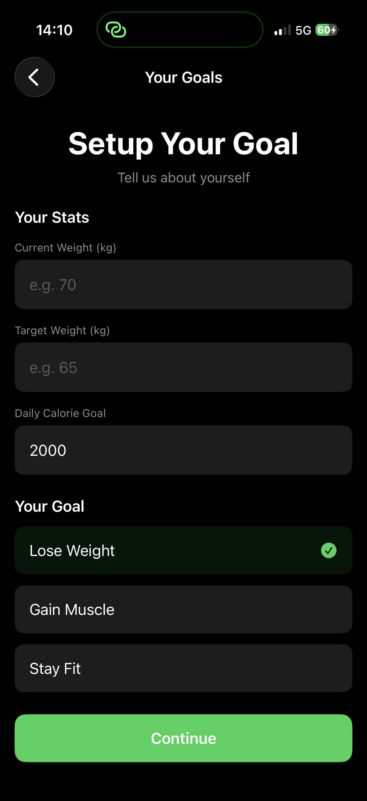
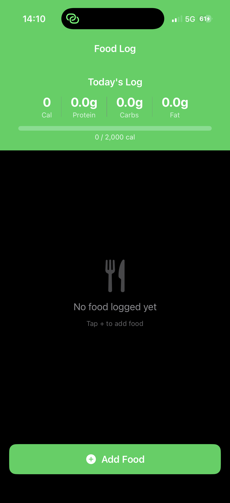
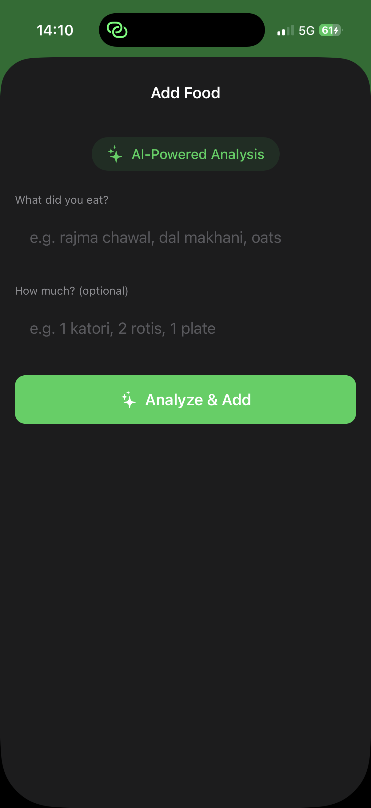
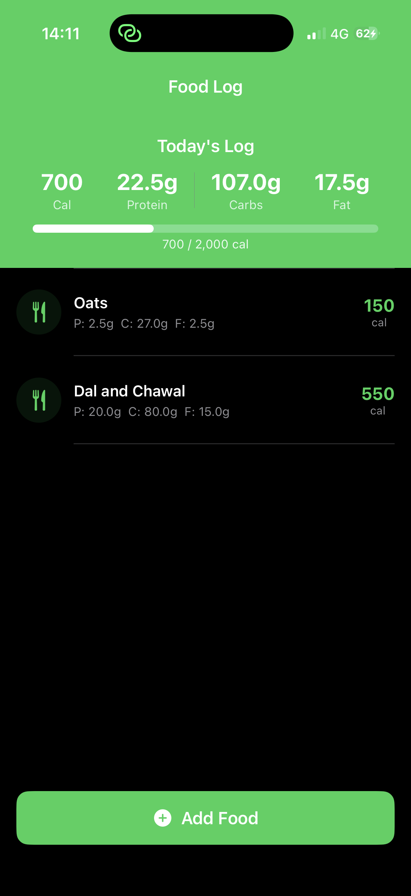

# 🏋️ FitMacro AI

> AI-powered fitness tracking app for iOS with a FastAPI backend.  
> Describe any food in natural language → Get instant calorie and macro breakdown.

[](https://fit-macro-ai-backend.vercel.app)
[](https://github.com/bhatt-aditya03/FitMacroAI)
[](https://python.org)
[](https://swift.org)

---

## 📸 Screenshots

| Onboarding | Goal Setup | Food Log | Add Food | Macros Tracked |
|-----------|-----------|---------|---------|---------------|
|  |  |  |  |  |

---

## 🎯 What This Does

Most fitness apps require manual food selection from a database. FitMacro AI lets you describe food naturally — "2 rotis with dal" or "1 plate rajma chawal" — and instantly returns calories, protein, carbs and fat using an AI-powered backend.

---

## ✨ Features

- 🤖 Natural language food analysis via Groq AI (llama-3.3-70b)
- 📊 Real-time macro tracking (calories, protein, carbs, fat)
- 🎯 Personalized calorie goals with progress bar
- 🔄 Automatic daily reset at midnight
- 💾 Persistent storage with UserDefaults
- 📱 Clean SwiftUI interface with onboarding flow

---

## 🛠️ Tech Stack

| Layer | Technology |
|-------|-----------|
| iOS Frontend | SwiftUI, Swift 5.9 |
| API Backend | FastAPI, Python |
| AI Analysis | Groq (llama-3.3-70b-versatile) |
| Deployment | Vercel |
| Storage | UserDefaults |

---

## 📂 Project Structure

FitMacroAI/
├── ios/                               # SwiftUI iOS app
│   ├── FitMacroAI/
│   │   ├── FitMacroAIApp.swift        # App entry point
│   │   ├── ContentView.swift          # Root view + onboarding
│   │   ├── FoodLogView.swift          # Main food logging screen
│   │   ├── GoalSetupView.swift        # Goal setup screen
│   │   └── UserDefaultsManager.swift  # Local persistence
│   └── FitMacroAI.xcodeproj/
├── backend/                           # FastAPI backend
│   ├── main.py                        # API endpoints
│   ├── requirements.txt               # Python dependencies
│   ├── vercel.json                    # Vercel config
│   └── Procfile                       # For Railway/Heroku deployment
├── screenshots/                       # App screenshots
└── README.md

---

## 🚀 Run Locally

### Backend
```bash
cd backend
pip install -r requirements.txt
uvicorn main:app --reload
```

### iOS App

1. Open ios/FitMacroAI.xcodeproj in Xcode
2. Select your target device or simulator
3. Press Cmd+R to build and run

> **Note:** Backend is already live at https://fit-macro-ai-backend.vercel.app — you don't need to run it locally to test the iOS app.  
> To point the iOS app to a different backend, update `baseURL` in `FoodLogView.swift`.

---

## 📱 API Endpoint

```json
POST https://fit-macro-ai-backend.vercel.app/analyze-food

{
  "food_description": "2 rotis with dal",
  "quantity": "1 plate"
}
```

**Response:**
```json
{
  "food_name": "Roti with Dal",
  "calories": 320,
  "protein": 12.5,
  "carbs": 48.0,
  "fat": 6.2,
  "serving_size": "1 plate"
}
```

---

## 👨‍💻 Author

**Aditya Bhatt**