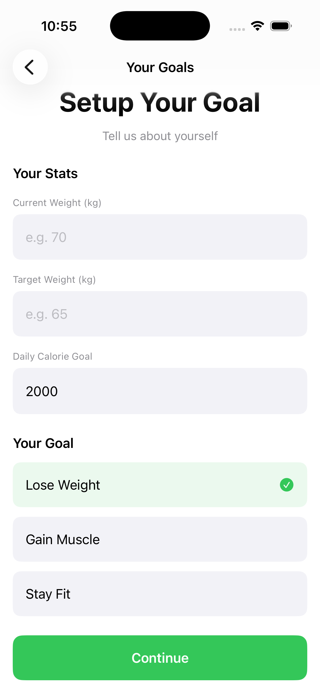
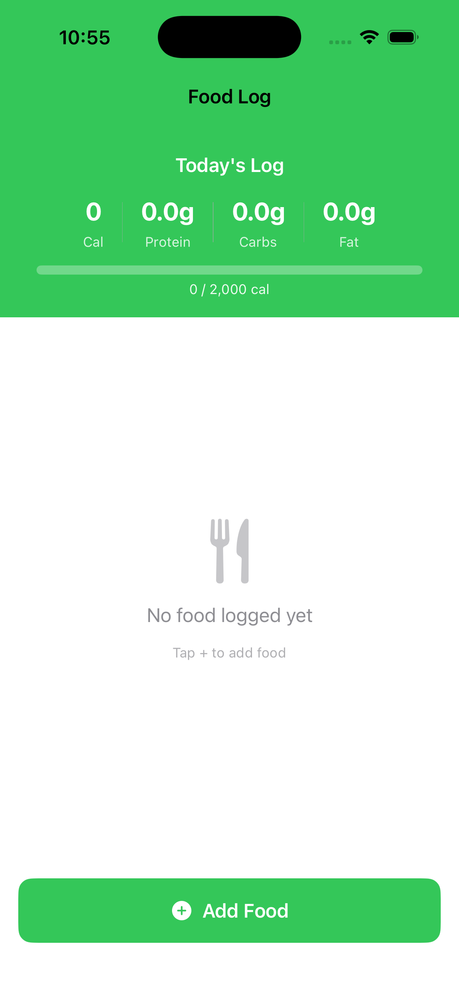
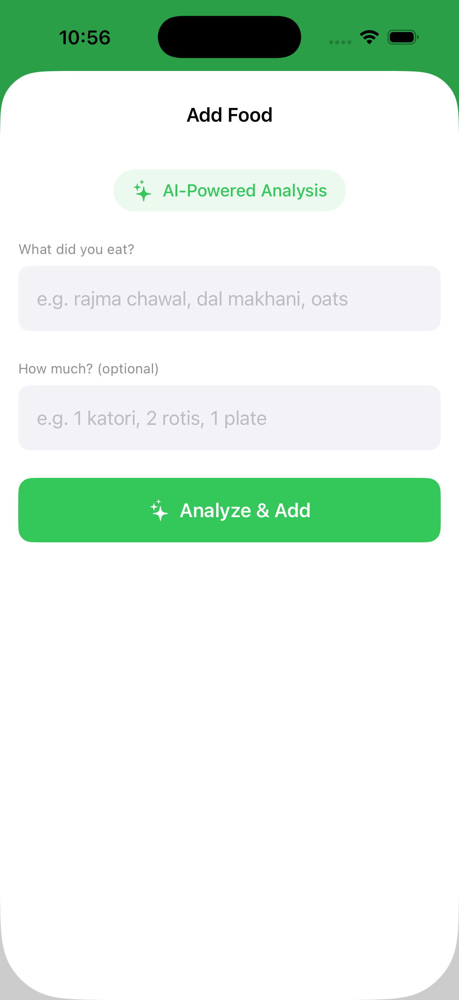

# FitMacroAI 🏋️‍♂️

An AI-powered iOS fitness app that tracks calories and macros using natural language food input.

## Demo
> User types "rajma chawal 1 katori" → AI returns 420 cal, 19g protein, 60g carbs, 14g fat automatically

## Features
- 🤖 AI-powered food analysis — just type food name, get macros instantly
- 📊 Track 4 macros — Calories, Protein, Carbs, Fat
- 🎯 Daily calorie goal with progress bar
- 💾 Data persistence — food log saves across app restarts
- 🔄 Daily auto reset — fresh start every morning
- ✅ Onboarding flow — one-time setup

## Tech Stack
- **Frontend:** SwiftUI (iOS 17+)
- **Backend:** FastAPI + Python
- **AI:** LLaMA 3.3 70B via Groq API
- **Deployment:** Railway.app
- **Storage:** UserDefaults

## Architecture
```
iOS App (SwiftUI)
      ↓ HTTP POST
FastAPI Backend (Railway)
      ↓ API Call
Groq AI (LLaMA 3.3 70B)
      ↓ JSON Response
iOS App displays macros
```

## Backend
Live API: https://web-production-f32bc.up.railway.app

Repo: [FitMacroAI-Backend](https://github.com/bhatt-aditya03/FitMacroAI-Backend)

## Status
✅ Complete — Day 15/15

## Screenshots

| Startup Screen | Goal Setup Screen | Food Log | Add Food |
|----------------| ------------------| ---------| ---------|
|  |  |  | 
